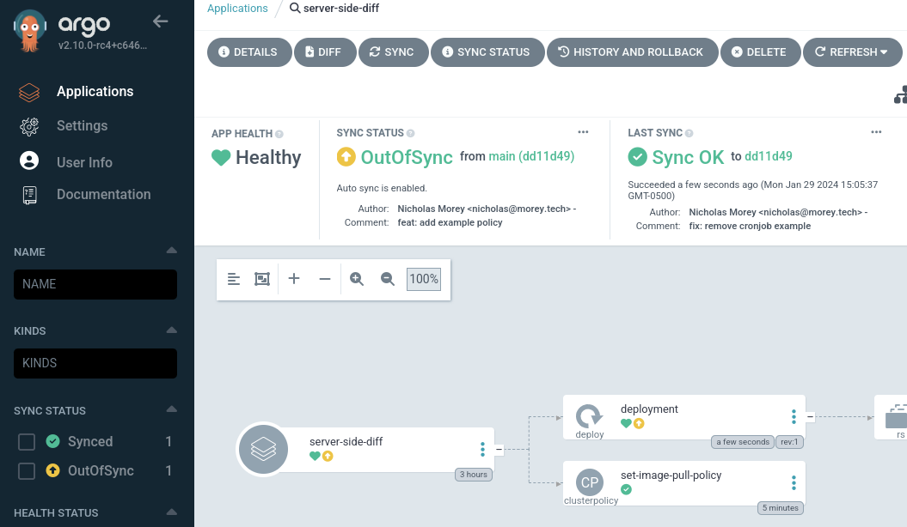
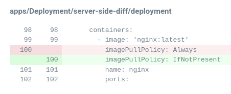

# Argo CD v2.10 Examples

## Bootstrapping Argo CD
```
kind create cluster --config kind-cluster.yaml
kubectl apply -k argocd
kubectl apply -f apps.yaml
```

This example includes a `devcontainer` configuration, allowing you to automatically create an environment for testing using the VSCode Dev Containers extension or GitHub Codespaces.

## Accessing the UI
Navigate to [https://localhost:8080/](https://localhost:8080/) on the machine with the `kind` cluster running.

Get the generated `admin` password.
```
argocd admin initial-password -n argocd
```

## Clean Up
```
kind delete cluster --name argocd-v2-10-examples
```

## Examples
https://blog.argoproj.io/argo-cd-v2-10-release-candidate-f69ba7bf9e06
> over 52 new features, 75 bug fixes, and 44 documentation updates with a total of 230 contributors!

### Server-Side Diff
> Argo CD main diff strategy uses a 3-way comparison between live, desired and last-applied-configuration states. However, with the introduction of Server-Side Apply (SSA) as a new sync option in version 2.5, we implemented a new diff logic based on the kubernetes library called “structured-merge-diff”. Since then, we learned from the community about the different limitations with our new approach.
> 
> To address these issues, we’re introducing a new diff option that performs a SSA in dry-run mode to determine the predicted live state. By caching the SSA response, we can reduce the load on the Kubernetes API and reduce inconsistencies with CRD schema updates. Comparing the SSA response with the live state will give us a more accurate and efficient assessment of resource sync.
> 
> One additional benefit of this new feature is that it addresses the current limitations with admission controllers, where mutation and validation webhooks are only executed in the cluster. With this new feature, admission controllers will be executed as part of the diffing stage.

Diff strategy to invoke a Server-Side Apply in dryrun mode in order to generate the predicted live state.

Server-Side Apply requests to Kube API are only triggered when:

- An Application refresh or hard-refresh is requested.
- There is a new revision in the repo which the Argo CD Application is targeting.
- The Argo CD Application spec changed.

- https://github.com/argoproj/argo-cd/pull/13663
- https://github.com/leoluz

#### Mutating Webhooks (Kyverno)
Server-Side diff will address the limitation where admission controllers with mutating webhooks are only executed in the cluster, leading to a diff between the desired state (before the mutation) and the live state (after mutation). Server-Side diff will be a huge improvement for working with Kyverno policies with mutating rules for resources managed by Argo CD.

Take for example, a mutation policy that automatically sets the `ImagePullPolicy` on `Deployments` to `Always` where the image is using the `latest` tag.
```yaml
apiVersion: kyverno.io/v1
kind: ClusterPolicy
metadata:
  name: set-image-pull-policy
spec:
  rules:
    - name: set-image-pull-policy
      match:
        any:
        - resources:
            kinds:
            - Deployment
            namespaces:
            - server-side-diff
      mutate:
        patchStrategicMerge:
          spec:
            template:
              spec:
                containers:
                  # match images which end with :latest
                  - (image): "*:latest"
                    # set the imagePullPolicy to "Always"
                    imagePullPolicy: "Always"
```

Without using server-side diff, the Application will be perpetually out-of-sync if the desired state does not use `ImagePullPolicy: Always`.




However, with server-side diff enabled on the Application using the `compare-options` annotation:
```yaml
apiVersion: argoproj.io/v1alpha1
kind: Application
metadata:
  annotations:
    # Enable Server-Side Diff.
    # Server-Side Diff does not include changes made by mutation webhooks by default.
    argocd.argoproj.io/compare-options: ServerSideDiff=true,IncludeMutationWebhook=true
```

The Application will use take into account the result from the mutating webhook for the Kyverno policy.

#### ManagedFields on SSA
- https://github.com/argoproj/argo-cd/issues/11136
    - Solves the issue of when the managedFields of a resource has an outdated API version:
      
      ```
      metadata:
        managedFields:
            - apiVersion: networking.k8s.io/v1beta1
            fieldsType: FieldsV1
            fieldsV1:
                f:metadata:
                f:annotations:
                    .: {}
                    f:alb.ingress.kubernetes.io/actions.ssl-redirect: {}
                    f:alb.ingress.kubernetes.io/certificate-arn: {}
                    f:alb.ingress.kubernetes.io/listen-ports: {}
                    f:alb.ingress.kubernetes.io/scheme: {}
                    f:alb.ingress.kubernetes.io/ssl-policy: {}
                    f:alb.ingress.kubernetes.io/target-type: {}
                f:labels:
                    .: {}
                    f:app.kubernetes.io/instance: {}
            manager: kubectl
            operation: Update
            time: "2021-05-28T16:20:40Z"
      ```

      Compared to the newer version on the resource that is being applied:
      ```
      metadata:
        managedFields:
            - apiVersion: networking.k8s.io/v1
            fieldsType: FieldsV1
            fieldsV1:
                f:metadata:
                f:annotations:
                    .: {}
                    f:alb.ingress.kubernetes.io/actions.ssl-redirect: {}
                    f:alb.ingress.kubernetes.io/certificate-arn: {}
                    f:alb.ingress.kubernetes.io/group.name: {}
                    f:alb.ingress.kubernetes.io/listen-ports: {}
                    f:alb.ingress.kubernetes.io/scheme: {}
                    f:alb.ingress.kubernetes.io/ssl-policy: {}
                    f:alb.ingress.kubernetes.io/target-type: {}
                f:labels:
                    .: {}
                    f:app.kubernetes.io/instance: {}
                f:spec:
                f:ingressClassName: {}
                f:rules: {}
            manager: kubectl-client-side-apply
            operation: Update
      ```

      Server-Side Diff resolves this by using the result from kube API server, instead of the managed fields on the resource.

### ApplicationSet Template Patch
> With this new feature, you can define templates without being limited to string-only fields. This gives you more granular control over your configurations. For example, you can toggle fields under source to generate applications from different repositories, such as Helm charts from Bitnami and customized packages from private repos.
> 
> One of the most common use cases for this feature is toggling auto sync on and off using values from AppSet generators. This is a very common practice when end users are testing changes against a specific environment and they don’t want their changes to be erased if there is a commit to Git.

- advanced templating using template patches ([#14893](https://github.com/argoproj/argo-cd/pull/14893)), [Geoffrey Muselli](https://github.com/speedfl)
- ApplicationSet template patch, use helm and kustomize in the same appset.
- Dynamic ignoreDifferences when using AppSet
- https://argo-cd.readthedocs.io/en/latest/operator-manual/applicationset/Template/#template-patch

### Sync Jitter
> Whenever we hit the timeout.reconciliation, the controller triggers a refresh of almost all applications to the repo-server. With a high volume of applications, this creates CPU spikes on the controller and especially on the repo-server when a monorepo is used for multiple applications.
> 
> Using scheduling jitter would allow the repo-server to have a more evenly distributed load, reduce spikes, reduce the time it takes to refresh apps and reduce repo-server cost.

- https://github.com/argoproj/argo-cd/pull/16820
- https://github.com/argoproj/argo-cd/issues/14241

- https://github.com/argoproj/argo-cd/issues/8172#issuecomment-1912339917
> I bumped my version to v2.10.0-rc4 in order to test jitter implementation on reconciliation. [...] The results till now are incredible, no delay at all in ArgoCD UI/Front. If i delete a pod, the new pod appears instantly

### Support for Kustomize Components
> Kustomize components provide a powerful way to modularize and reuse configuration in Kubernetes applications. It would be valuable for ArgoCD to support this feature to enhance its usability.

- https://github.com/argoproj/argo-cd/pull/16230/files
- https://github.com/argoproj/argo-cd/issues/15925
- https://github.com/kubernetes-sigs/kustomize/blob/master/examples/components.md

### Status Panel Extensions
> Extend the status panel of an application to display extra information on the application's status. 

- https://github.com/argoproj/argo-cd/pull/15780
- https://github.com/alexymantha/argocd-progressive-sync-extension
### PostDelete hook support
> Clean up resources after an Application has been deleted.

- https://github.com/argoproj/argo-cd/pull/16595

### Apps in Any Namespace & Notifications
> With the recent introduction of apps-in-any-namespace in version 2.5, users can now self-serve their apps. This has been a major improvement, allowing users to create, deploy, and manage their own apps across multiple namespaces.
> 
> Now, with the addition of the new self-serve notifications configuration feature, users can take even greater control of their apps’ settings. End-users have the ability to configure notifications for their Argo CD application in their namespaces, without having to rely on Argo CD admins to make these changes.

- https://github.com/argoproj/argo-cd/pull/16488
- https://github.com/mayzhang2000
